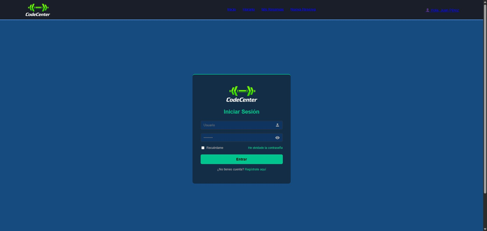
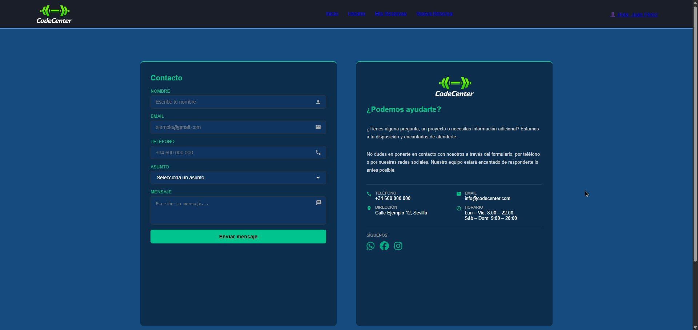
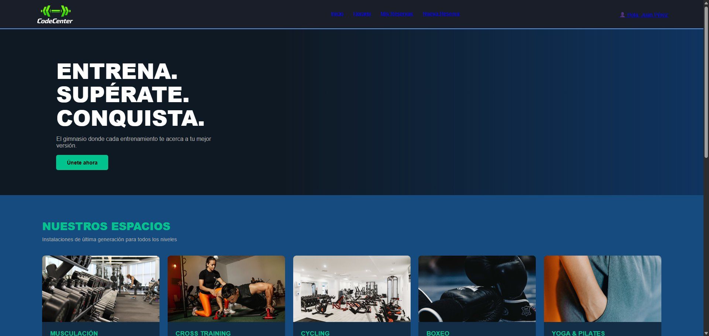

# CodeCenter Gym – Proyecto Web

---

## Tecnologías utilizadas
- HTML5 y CSS3
- Google Material Icons (iconos de formularios)
- Font Awesome (iconos de redes sociales)

---

## Páginas desarrolladas

### 1. Login (`login.html` / `login.css`)
Página de inicio de sesión para los miembros del gimnasio.

- Navbar con logo y menú de navegación (Inicio, Mis Reservas, Nueva Reserva, Mi Perfil)
- Tarjeta centrada con el logo de CodeCenter
- Campo de usuario con icono de persona y campo de contraseña con icono de ojo
- Checkbox "Recuérdame" y enlace para recuperar contraseña
- Botón de acceso y enlace para registrarse
- Footer con dirección, copyright y redes sociales




---

### 2. Contacto (`contacto.html` / `contacto.css`)
Página de contacto formada por dos tarjetas simétricas.

- **Tarjeta izquierda:** Formulario con campos de Nombre, Email, Teléfono, Asunto y Mensaje, cada uno con su icono de Material Icons
- **Tarjeta derecha:** Logo del gimnasio, texto informativo, datos de contacto en dos columnas (Teléfono, Email, Dirección, Horario) e iconos de WhatsApp, Facebook e Instagram




---

### 3. Instalaciones (`instalaciones.html` / `instalaciones.css`)
Página principal con información sobre las instalaciones y clases del gimnasio.

- Navbar y sección Hero con título y botón de llamada a la acción
- Sección **Nuestros Espacios** con tarjetas de: Musculación, Cross Training, Cycling, Boxeo y Yoga & Pilates, cada una con imagen, descripción y lista de características
- Sección **Clases Dirigidas** con tarjetas e iconos para cada actividad
- Sección CTA animando al usuario a unirse
- Footer con dirección, copyright y redes sociales




---

## Estructura de archivos
```
├── login.html
├── login.css
├── contacto.html
├── contacto.css
├── instalaciones.html
├── instalaciones.css
└── img/
    └── logo.png
```
