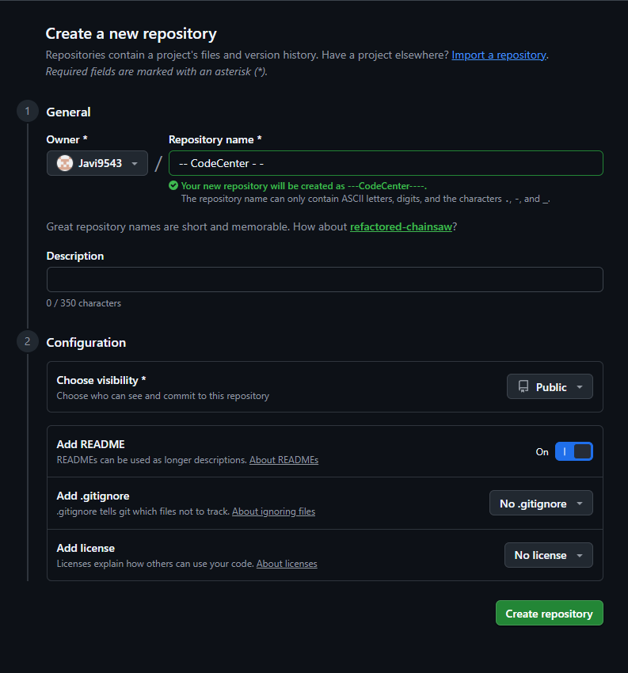
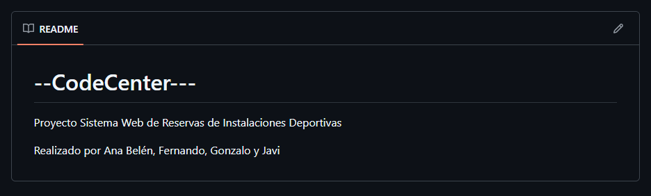
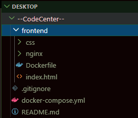
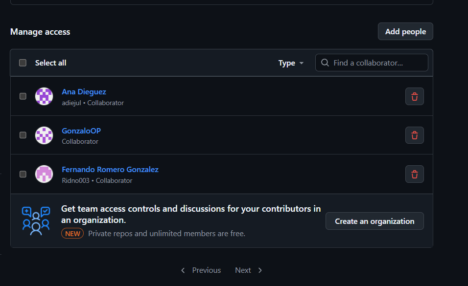

# --CodeCenter (Parte Javier Muñoz Parra)

## REPOSITORIO DE GIT 
 - ### Creacion del repositorio 
    Lo primero que hago para crear el repositorio en github con el nombre del repo, y en el readme del repositorio, pongo los integrantes del grupo y el proyecto que nos ha tocado, luego.

     

    

    ahora en local añado el repositorio para poder hacer pull, pushear mis codigos fuente, y se veria de esta manera:

    

    Después creo la estructura de carpetas y archivos en git, para que tanto yo, como mis compañeros podamos trabajar en este proyecto y subir nuestros archivos, que nuestra estructura de archivos es la siguiente: 

    

    Por ultimo, añado a mis compañeros de trabajo como colaboradores a mi repositorio de git en settings > collaborators > add people y una vez añadidos sus correos me sale de esta forma: 

    

    Y la estructura inicial de git esta finalizada

## ESTRUCTURA DE AWS (Creacion de los siguientes elementos):

 - ### VPC
  Primero creo la VPC en la que alojaré las instancias de aws, que a su vez cada una irá enlazada a una subred, la instancia del frontend ira enlazada a la subred publica y la instancia del backend ira enlazada a la subred privada, que a su vez iran conectadas mediante una nat gateway (que creare proximamente ya que consume muchos $ de aws).

  
 - ### Subredes
  - subred publica

  - subred privada

 - ### Tabla de enrutamiento
  - puerta de enlace publica

  - puerta de enlace privada

 - ### Instancias
  - Instancia Publica: 
## Configuracion de dependencias de Instancias de AWS
 - ### Instancia Frontend

 - ### Instancia Backend
## CODIGO FUENTE: 
 - ### FRONTEND
    1- Apartado Horario
      - Explicación documento HTML

      - Explación documento CSS  

    2- Apartado Cuotas
      - Explicación documento HTML
      
      - Explación documento CSS  
      
 - ### BACKEND

